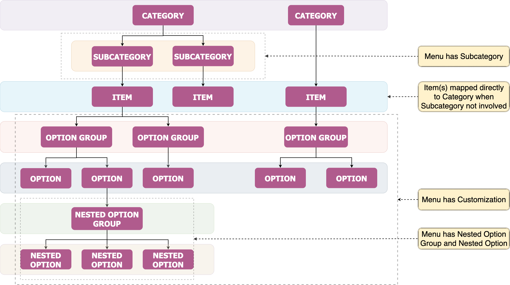

# Zomato POS Integration — Menu Glossary: Relationships, Hierarchy & Values

> **Purpose**: This document maps every glossary category relevant to menu management,
> lists all valid values, shows how categories relate to each other, and walks through
> complete examples of building a menu item from scratch.

---

## Table of Contents

1. [High-Level Relationship Diagram](#1-high-level-relationship-diagram)
2. [Category Details & All Valid Values](#2-category-details--all-valid-values)
   - [2.1 Tax Groups](#21-tax-groups)
   - [2.2 Taxes (Individual Components)](#22-taxes-individual-components)
   - [2.3 Tax Group → Tax Mapping](#23-tax-group--tax-mapping)
   - [2.4 Tags](#24-tags)
   - [2.5 Charges](#25-charges)
   - [2.6 Preparation Time](#26-preparation-time)
   - [2.7 Units](#27-units)
   - [2.8 Catalogue Kind](#28-catalogue-kind)
   - [2.9 Meat Types](#29-meat-types)
   - [2.10 Allergens](#210-allergens)
   - [2.11 Serving Info](#211-serving-info)
   - [2.12 Menu Moderation](#212-menu-moderation)
   - [2.13 Categories & Sub-Categories](#213-categories--sub-categories)
   - [2.14 Option Groups (Modifiers)](#214-option-groups-modifiers)
   - [2.15 Options](#215-options)
   - [2.16 Nested Option Groups & Nested Options](#216-nested-option-groups--nested-options)
3. [Hierarchy: How a Menu Item Connects Everything](#3-hierarchy-how-a-menu-item-connects-everything)
4. [Complete Worked Examples](#4-complete-worked-examples)
   - [Example 1: Butter Chicken (Non-Veg, Standard Item)](#example-1-butter-chicken-non-veg-standard-item)
   - [Example 2: Margherita Pizza (Veg, with Variants)](#example-2-margherita-pizza-veg-with-variants)
   - [Example 3: Celebration Cake (Special Catalogue Kind)](#example-3-celebration-cake-special-catalogue-kind)
   - [Example 4: Combo Box Meal (box-fixed-piece Kind)](#example-4-combo-box-meal-box-fixed-piece-kind)
   - [Example 5: Burger Combo (Nested Option Groups)](#example-5-burger-combo-nested-option-groups)
5. [Moderation Lifecycle](#5-moderation-lifecycle)
6. [Non-Menu Glossary Categories (Reference Only)](#6-non-menu-glossary-categories-reference-only)

---

## 1. High-Level Relationship Diagram

### Menu Structure Architecture

The menu is governed by the following key structural concepts, in order of nesting:

1. **Category** and **Sub-Category**
2. **Items**
3. **Variants**
4. **Option Groups**
5. **Options**
6. **Nested Option Groups** and **Nested Options**



```
CATEGORY  ─────────────────────────────────────→  Menu has Category
   │
   ├── SUB-CATEGORY (optional) ─────────────────→  Menu has Sub-Category
   │      │
   │      └── ITEM
   │
   └── ITEM ─────────────────────────────────────→  Item(s) mapped directly to
          │                                          Category when Sub-Category
          │                                          is not involved
          │
          ├── VARIANT(S) ─────────────────────────→  Portion / size / price options
          │
          └── OPTION GROUP ───────────────────────→  Menu has Customization
                 │
                 └── OPTION
                      │
                      └── NESTED OPTION GROUP ─────→  Menu has Nested Option Group
                             │                        and Nested Option
                             └── NESTED OPTION
```

> **Reading the flow:** A **Category** may contain **Sub-Categories** or map **Items** directly.
> Each **Item** carries one or more **Variants** (kept as-is — see the worked examples) and any
> number of **Option Groups**. Each Option Group holds **Options**, and an Option may itself open a
> **Nested Option Group** containing **Nested Options** — the deepest level of customization.

---

```
┌─────────────────────────────────────────────────────────────────────────────────┐
│                              MENU ITEM (Catalogue)                             │
│                                                                                │
│  name: "Butter Chicken"                                                        │
│  description: "Creamy tomato-based curry with tender chicken"                  │
│  kind: "default"                                                               │
│                                                                                │
│  ┌──────────────────────────────────────────────────────────────────────────┐   │
│  │  VARIANT(S)                                                             │   │
│  │  ├─ "Half"  → price: 250  → tax_group: GST_D_P_5.00                    │   │
│  │  └─ "Full"  → price: 450  → tax_group: GST_D_P_5.00                    │   │
│  │                  │                    │                                  │   │
│  │                  │                    └──→ TAX GROUP ──→ TAXES           │   │
│  │                  │                         (GST 5%)      (CGST 2.5%     │   │
│  │                  │                                       + SGST 2.5%)   │   │
│  │                  │                                                      │   │
│  │                  └──→ UNIT: "serves"  QUANTITY: 2                       │   │
│  └──────────────────────────────────────────────────────────────────────────┘   │
│                                                                                │
│  ┌─────────────┐  ┌──────────────┐  ┌──────────────┐  ┌─────────────────┐     │
│  │   TAGS       │  │  CHARGES     │  │  PREP TIME   │  │  METADATA       │     │
│  │             │  │              │  │              │  │                 │     │
│  │ • non-veg   │  │ • PC_D_F     │  │ • 15to20min  │  │ • meat_types:   │     │
│  │ • spicy     │  │   (₹15 fixed │  │              │  │   [chicken]     │     │
│  │ • chef-     │  │    delivery) │  │              │  │ • allergens:    │     │
│  │   special   │  │              │  │              │  │   [milk]        │     │
│  │ • goods     │  │              │  │              │  │ • serving_info: │     │
│  │   (GST)     │  │              │  │              │  │   2to3people    │     │
│  │             │  │              │  │              │  │ • calorie_count:│     │
│  └─────────────┘  └──────────────┘  └──────────────┘  │   450           │     │
│                                                        └─────────────────┘     │
│                                                                                │
│  ┌──────────────────────────────────────────────────────────────────────────┐   │
│  │  MODERATION STATUS                                                      │   │
│  │  CATALOGUE       → APPROVED                                             │   │
│  │  CATALOGUE_NAME  → APPROVED                                             │   │
│  │  VARIANT_PRICE   → UNDER_REVIEW  (price changed from 400 → 450)        │   │
│  │  MEDIA           → APPROVED                                             │   │
│  └──────────────────────────────────────────────────────────────────────────┘   │
└─────────────────────────────────────────────────────────────────────────────────┘
```

### Relationship Flow (Simplified)

```
Category
 │
 ├──→ has SUB-CATEGORY (optional) ──→ groups items further
 │
 └──→ has ITEM(S) ──────────→ mapped directly to Category when no Sub-Category

Menu Item (Catalogue)
 │
 ├──→ has KIND ─────────────→ "default" | "celebration-cake" | "box-fixed-piece"
 │
 ├──→ has TAGS ─────────────→ Dietary (MANDATORY: veg/non-veg/egg)
 │                            + Miscellaneous (optional: spicy, new, etc.)
 │                            + Legally Sensitive (contains-alcohol)
 │                            + GST Classification (goods/services)
 │
 ├──→ has VARIANT(S) ──────→ Each variant has:
 │     │                       ├── price
 │     │                       ├── tax_group ──→ maps to → individual taxes
 │     │                       ├── unit + quantity (portion size)
 │     │                       └── charge(s) (packaging for delivery)
 │     │
 │     └──→ TAX GROUP ──────→ Contains TAXES
 │          GST_D_P_5.00       ├── CGST_D_P_2.50
 │                             └── SGST_D_P_2.50
 │
 ├──→ has OPTION GROUP(S) ──→ Customization (a.k.a. Modifier Group)
 │     │                       ├── min_selection / max_selection
 │     │                       └── OPTION(S)
 │     │                            ├── name + add-on price
 │     │                            └── NESTED OPTION GROUP (optional)
 │     │                                 └── NESTED OPTION(S)
 │     │
 │     └──→ Appears as "Menu has Customization" in the architecture
 │
 ├──→ has METADATA ─────────→ meat_types[]
 │                            allergen_types[]
 │                            serving_info
 │                            portion_size (value + unit)
 │                            calorie_count
 │                            protein_count
 │                            carbohydrate_count
 │                            fat_count
 │                            fiber_count
 │
 ├──→ has PREPARATION TIME ─→ e.g., "15to20min"
 │
 ├──→ has MEDIA ────────────→ item images
 │
 └──→ MODERATION ───────────→ Every field change goes through:
                               UNDER_REVIEW → APPROVED / REJECTED
```

---

## 2. Category Details & All Valid Values

### 2.1 Tax Groups

Tax groups are the **top-level tax identifiers** assigned to menu item variants. Each tax group bundles one or more individual taxes.

| Identifier | Name | Calc Type | Value (%) | Service |
|---|---|---|---|---|
| `GST_D_P_5.00` | GST | percentage | 5 | all |
| `GST_D_P_12.00` | GST | percentage | 12 | all |
| `GST_D_P_18.00` | GST | percentage | 18 | all |
| `KERALACESS_D_P_1.00` | Kerala Cess | percentage | 1 | all |
| `MUNICIPALITYTAX_D_P_10.00` | Municipality Tax | percentage | 10 | all |
| `MUNICIPALITYTAX_D_P_2.00` | Municipality Tax | percentage | 2 | all |
| `MUNICIPALITYTAX_D_P_7.00` | Municipality Tax | percentage | 7 | all |
| `MUNICIPALITYTAX_D_P_3.50` | Municipality Tax | percentage | 3.5 | all |
| `VAT_D_P_5.00` | VAT | percentage | 5 | all |

**When to use which:**
- `GST_D_P_5.00` → Most common for restaurants (non-AC, turnover < ₹75L threshold)
- `GST_D_P_12.00` → Restaurants with AC / specific classifications
- `GST_D_P_18.00` → Outdoor catering, alcohol-related, high-end services
- `VAT_D_P_5.00` → Specific state VAT scenarios
- `KERALACESS / MUNICIPALITYTAX` → Additional regional taxes (applied on top of GST)

---

### 2.2 Taxes (Individual Components)

These are the **individual tax line items** that appear on the customer's bill. They are NOT assigned directly to items — they are resolved through the Tax Group.

| Identifier | Name | Display Name | Calc Type | Value (%) | Services |
|---|---|---|---|---|---|
| `CGST_D_P_2.50` | CGST | CGST@2.5 | percentage | 2.5 | all |
| `CGST_D_P_6.00` | CGST | CGST@6 | percentage | 6 | all |
| `CGST_D_P_9.00` | CGST | CGST@9 | percentage | 9 | all |
| `SGST_D_P_2.50` | SGST | SGST@2.5 | percentage | 2.5 | all |
| `SGST_D_P_6.00` | SGST | SGST@6 | percentage | 6 | all |
| `SGST_D_P_9.00` | SGST | SGST@9 | percentage | 9 | all |
| `KERALACESS_D_P_1.00` | Kerala Cess | Kerala Cess | percentage | 1 | all |
| `MUNICIPALITYTAX_D_P_10.00` | Municipality Tax | Municipality Tax@10 | percentage | 10 | all |
| `MUNICIPALITYTAX_D_P_2.00` | Municipality Tax | Municipality Tax@2 | percentage | 2 | all |
| `MUNICIPALITYTAX_D_P_7.00` | Municipality Tax | Municipality Tax@7 | percentage | 7 | all |
| `MUNICIPALITYTAX_D_P_3.50` | Municipality Tax | Municipality Tax@3.5 | percentage | 3.5 | all |
| `VAT_D_P_5.00` | VAT | VAT@5 | percentage | 5 | all |

---

### 2.3 Tax Group → Tax Mapping

This is how a **tax group resolves into individual taxes** on the bill:

```
TAX GROUP                    INDIVIDUAL TAXES
─────────────                ─────────────────
GST_D_P_5.00       ──→      CGST_D_P_2.50  (2.5%)
                    ──→      SGST_D_P_2.50  (2.5%)
                             ────────────────────
                             Total: 5%

GST_D_P_12.00      ──→      CGST_D_P_6.00  (6%)
                    ──→      SGST_D_P_6.00  (6%)
                             ────────────────────
                             Total: 12%

GST_D_P_18.00      ──→      CGST_D_P_9.00  (9%)
                    ──→      SGST_D_P_9.00  (9%)
                             ────────────────────
                             Total: 18%

KERALACESS_D_P_1.00 ──→     KERALACESS_D_P_1.00  (1%)
                             (standalone, added on top of GST)

MUNICIPALITYTAX_*   ──→     MUNICIPALITYTAX_*  (same slug)
                             (standalone, added on top of GST)

VAT_D_P_5.00       ──→      VAT_D_P_5.00  (5%)
                             (standalone)
```

**Bill Example:**
```
Item: Butter Chicken (Full) ── ₹450
  Tax Group: GST_D_P_5.00
    ├── CGST @2.5%  = ₹11.25
    └── SGST @2.5%  = ₹11.25
  ──────────────────────────
  Total Tax:         ₹22.50
  Grand Total:       ₹472.50
```

---

### 2.4 Tags

Tags are applied to **catalogue items** (not variants). Some groups allow only one tag (single-select), others allow multiple.

#### Dietary Tags (MANDATORY — Single Select: pick exactly one)

| Slug | Name | Purpose |
|---|---|---|
| `veg` | Veg | Green dot indicator 🟢 |
| `non-veg` | Non-Veg | Red dot indicator 🔴 |
| `egg` | Egg | Brown/yellow dot indicator 🟤 |

> **Every menu item MUST have exactly one dietary tag.** This drives the veg/non-veg filter on the Zomato app.

#### Miscellaneous Tags (Optional — Multi Select)

| Slug | Name |
|---|---|
| `cake` | Cake |
| `chef-special` | Chef's Special |
| `dairy-free` | Dairy Free |
| `fodmap-friendly` | FODMAP Friendly |
| `gluten-free` | Gluten Free |
| `lactose-free` | Lactose Free |
| `new` | New |
| `restaurant-recommended` | Restaurant Recommended |
| `seasonal` | Seasonal |
| `spicy` | Spicy |
| `vegan` | Vegan |
| `wheat-free` | Wheat Free |
| `contains-pork` | Contains Pork |
| `home-style-meal` | Home Style Meal |

#### Legally Sensitive Tags (Multi Select)

| Slug | Name |
|---|---|
| `contains-alcohol` | Contains Alcohol |

#### Info Tags (Multi Select)

| Slug | Name |
|---|---|
| `mrp-item` | MRP Item |

#### GST Classification Tags (Single Select — pick one)

| Slug | Name | Purpose |
|---|---|---|
| `goods` | Goods | Item is classified as physical goods for GST |
| `services` | Services | Item is classified as a service for GST |

#### Celebration-Cake Specific Tags

**Flavors (Single Select within celebration-cake kind):**

| Slug | Name |
|---|---|
| `cake-flavor-chocolate` | Chocolate |
| `cake-flavor-black-forest` | Black Forest |
| `cake-flavor-vanilla` | Vanilla |
| `cake-flavor-fruit` | Fruit |
| `cake-flavor-pineapple` | Pineapple |
| `cake-flavor-butterscotch` | Butterscotch |
| `cake-flavor-red-velvet` | Red Velvet |
| `cake-flavor-blueberry` | Blueberry |
| `cake-flavor-cheesecake` | Cheese Cake |
| `cake-flavor-strawberry` | Strawberry |
| `cake-flavor-cream` | Cream |
| `cake-flavor-mango` | Mango |

**Cake Type Tags (Multi Select within celebration-cake kind):**

| Slug | Name |
|---|---|
| `cake` | Cake |
| `anniversary-wedding-cake` | Anniversary/Wedding Cake |
| `tiered-cake` | Tiered Cake |
| `birthday-cake` | Birthday Cake |
| `kids-birthday-cake` | Kids Birthday Cake |
| `gourmet-cake` | Gourmet Cake |
| `premium-cake` | Premium Cake |

#### Tag Auto-Detection

Zomato **automatically detects** dietary tags from item names using keyword matching:
- **non-veg** keywords: chicken, mutton, fish, prawn, pork, etc. (200+ keywords)
- **egg** keywords: egg, eggs, omelette, omlette, etc.
- **Exceptions**: "veg egg", "mock chicken", "tofu", "vegan", etc. are NOT flagged as non-veg

---

### 2.5 Charges

Charges are **extra fees** applied to items for specific service modes.

| Identifier | Name | Display Name | Calc Type | Service |
|---|---|---|---|---|
| `PC_D_F` | Packaging Charge - Fixed | Packaging Charge | fixed | delivery |
| `PC_D_P` | Packaging Charge - Percentage | Packaging Charge | percentage | delivery |

**How they work:**
```
PC_D_F (Fixed):
  Item: Biryani → Packaging Charge = ₹30 (flat, regardless of item price)

PC_D_P (Percentage):
  Item: Biryani (₹350) → Packaging Charge = 5% of ₹350 = ₹17.50
```

> Charges apply ONLY to **delivery** orders. Dine-in and takeaway orders do not have packaging charges.

---

### 2.6 Preparation Time

Assigned per item or category. Predefined slugs only — no custom values.

| Identifier | Meaning |
|---|---|
| `0to5min` | 0–5 minutes |
| `5to10min` | 5–10 minutes |
| `10to15min` | 10–15 minutes |
| `15to20min` | 15–20 minutes |
| `20to25min` | 20–25 minutes |
| `25to30min` | 25–30 minutes |
| `30to35min` | 30–35 minutes |
| `35to40min` | 35–40 minutes |
| `40to45min` | 40–45 minutes |
| `45to50min` | 45–50 minutes |
| `50to55min` | 50–55 minutes |
| `55to60min` | 55–60 minutes |
| `60+min` | More than 60 minutes |

---

### 2.7 Units

Used in **portion_size** metadata to describe what the customer gets.

| Identifier | Meaning | Typical Use |
|---|---|---|
| `grams` | Weight in grams | Rice (250g), Naan (120g) |
| `kg` | Weight in kilograms | Biryani (1kg family pack) |
| `ml` | Volume in milliliters | Beverages (300ml), Soup (200ml) |
| `litre` | Volume in litres | Large drinks (1L) |
| `ounces` | Weight in ounces | Steak (8oz) |
| `pounds` | Weight in pounds | Meat portions |
| `serves` | Number of people | "Serves 2", "Serves 4" |
| `piece` | Number of pieces | Momos (6 pieces), Samosa (2 pieces) |
| `slice` | Number of slices | Pizza (8 slices) |
| `scoop` | Number of scoops | Ice cream (2 scoops) |
| `inches` | Length in inches | Pizza diameter (12 inches) |
| `cms` | Length in centimeters | Cake diameter (20 cm) |

---

### 2.8 Catalogue Kind

Defines the **type of catalogue**. Most items use `default` (implicit). Special kinds have additional validation rules and mandatory child entities.

| Kind | Entity Type | Description | Special Rules |
|---|---|---|---|
| *(none / default)* | Catalogue | Standard menu item | No extra validation |
| `celebration-cake` | Catalogue | Celebration cake root | Must have cake-specific modifiers (message placement, accessories) |
| `cake-message-on-the-cake` | Catalogue | "On the cake" message option | Child of `cake-message-placement` modifier |
| `cake-message-on-bottom-of-cake` | Catalogue | "On the bottom disc" option | Child of `cake-message-placement` modifier |
| `cake-message-on-chocolate-disc` | Catalogue | "Add a separate chocolate disc" option | Child of `cake-message-placement` modifier |
| `cake-birthday-candles` | Catalogue | Candles accessory | Child of `cake-accessories` modifier |
| `cake-birthday-knife` | Catalogue | Cake Knife accessory | Child of `cake-accessories` modifier |
| `cake-party-popper` | Catalogue | Party Popper accessory | Child of `cake-accessories` modifier |
| `box-fixed-piece` | Catalogue | Fixed-piece combo box | `rows` and `columns` are **mandatory** in `box_metadata` |

#### Celebration Cake Hierarchy
```
Catalogue (kind: "celebration-cake")
 ├── name: "Chocolate Truffle Cake"
 ├── tags: [egg, cake-flavor-chocolate, birthday-cake]
 │
 ├── Variant: "0.5 kg" → price: 550, unit: kg
 ├── Variant: "1 kg"   → price: 999, unit: kg
 │
 ├── Modifier Group: "cake-message-placement" (required)
 │    ├── Option (kind: cake-message-on-the-cake)        → "On the cake"
 │    ├── Option (kind: cake-message-on-bottom-of-cake)  → "On the bottom disc"
 │    └── Option (kind: cake-message-on-chocolate-disc)  → "Add chocolate disc" (+₹50)
 │
 └── Modifier Group: "cake-accessories" (optional)
      ├── Option (kind: cake-birthday-candles)  → "Candles" (+₹20)
      ├── Option (kind: cake-birthday-knife)    → "Cake Knife" (+₹15)
      └── Option (kind: cake-party-popper)      → "Party Popper" (+₹30)
```

#### Box Fixed-Piece Hierarchy
```
Catalogue (kind: "box-fixed-piece")
 ├── name: "Dessert Box"
 ├── box_metadata:
 │    ├── rows: 2
 │    └── columns: 3       ← MANDATORY for this kind
 │    (= 6 slots total)
 │
 ├── Variant: "6 Piece Box" → price: 450
 │
 └── Modifier Group: "Choose Items" (required, exactly 6 selections)
      ├── Gulab Jamun
      ├── Rasgulla
      ├── Kaju Katli
      ├── Barfi
      └── ...
```

---

### 2.9 Meat Types

Assigned to non-veg items in the `meat_types` metadata array. An item can have **multiple** meat types.

| Slug | Name |
|---|---|
| `chicken` | Chicken |
| `mutton` | Mutton |
| `goat` | Goat |
| `lamb` | Lamb |
| `fish` | Fish |
| `prawn` | Prawn |
| `shrimp` | Shrimp |
| `crab` | Crab |
| `lobster` | Lobster |
| `squid` | Squid |
| `octopus` | Octopus |
| `shellfish` | Shellfish |
| `duck` | Duck |
| `turkey` | Turkey |
| `quail` | Quail |
| `pigeon` | Pigeon |
| `goose` | Goose |
| `rabbit` | Rabbit |
| `pork` | Pork |
| `veal` | Veal |
| `venison` | Venison |
| `deer` | Deer |
| `bull` | Bull |
| `camel` | Camel |
| `frog` | Frog |
| `shark` | Shark |

---

### 2.10 Allergens

Assigned to items in the `allergen_types` metadata array. An item can have **multiple** allergens.

| Slug | Name / Covers |
|---|---|
| `gluten` | Gluten (wheat, barley, rye) |
| `crustacean` | Crustacean (crab, lobster, shrimp) |
| `egg` | Egg |
| `fish` | Fish |
| `tree-nuts` | Almonds, Brazil nuts, Cashews, Hazelnuts, Pecans, Pistachios, Walnuts |
| `peanut` | Peanut |
| `soybeans` | Soyabeans |
| `milk` | Milk (dairy, lactose) |
| `sulphite` | Sulphite |

---

### 2.11 Serving Info

Indicates how many people a single order of the item can serve. Set in `serving_info` metadata.

| Identifier | Meaning |
|---|---|
| `1to2people` | Serves 1–2 people |
| `2to3people` | Serves 2–3 people |
| `3to4people` | Serves 3–4 people |
| `4to5people` | Serves 4–5 people |
| `5to6people` | Serves 5–6 people |
| `6to7people` | Serves 6–7 people |
| `7to8people` | Serves 7–8 people |
| `8to9people` | Serves 8–9 people |
| `9to10people` | Serves 9–10 people |
| `10+people` | Serves 10+ people |

---

### 2.12 Menu Moderation

Every change to a menu entity goes through Zomato's moderation pipeline. This defines **what** gets moderated and the possible **statuses**.

#### Moderated Entity Types

| Entity Type | What Is Being Moderated | Fields Returned |
|---|---|---|
| `VARIANT_PRICE` | A variant's price or image was changed | `status`, `reason`, `price`, `media` |
| `CATALOGUE` | The catalogue entity itself (create/delete) | `status`, `reason` |
| `CATALOGUE_TAG` | A tag was added/removed on a catalogue | `status`, `reason`, `tag_slug` |
| `CATALOGUE_NAME` | The item name was changed | `status`, `reason`, `name` |
| `CATALOGUE_DESC` | The description was changed | `status`, `reason`, `desc` |
| `CATALOGUE_META` | A metadata field was changed | `status`, `reason`, `meta_key`, `meta_value` |
| `MEDIA` | An item image was added/changed | `status`, `reason`, `media` |

#### Moderable Metadata Keys

These are the `meta_key` values that can appear in `CATALOGUE_META` moderation:

| meta_key | What It Represents |
|---|---|
| `calorie_count` | Calorie value |
| `protein_count` | Protein (grams) |
| `carbohydrate_count` | Carbs (grams) |
| `fat_count` | Fat (grams) |
| `fiber_count` | Fiber (grams) |
| `portion_size` | Size + unit (e.g., 250 grams) |
| `serving_info` | People served slug |
| `allergen_types` | Allergen slug array |
| `meat_types` | Meat type slug array |

#### Moderation Statuses

| Status | Meaning |
|---|---|
| `UNDER_REVIEW` | Change submitted, pending Zomato review |
| `APPROVED` | Change accepted and live on Zomato |
| `REJECTED` | Change denied (reason provided) |

---

### 2.13 Categories & Sub-Categories

Categories are the **top-level organizational buckets** of a menu. Sub-categories are an **optional** intermediate grouping layer between a category and its items.

| Concept | Required? | Purpose | Example |
|---|---|---|---|
| **Category** | Mandatory | Top-level menu section | "Starters", "Main Course", "Beverages", "Desserts" |
| **Sub-Category** | Optional | Further splits a category | "Main Course" → "Veg Curries", "Non-Veg Curries", "Breads" |

**Item placement rules (per the architecture diagram):**
- When sub-categories are used, items are mapped to a **sub-category**.
- When sub-categories are **not** used, items are mapped **directly to the category**.

```
Category: "Main Course"
 ├── Sub-Category: "Veg Curries"      → Item: "Paneer Butter Masala"
 ├── Sub-Category: "Non-Veg Curries"  → Item: "Butter Chicken"
 └── (no sub-category)                → Item: "Dal Tadka"   ← mapped directly to Category
```

**Common fields:** `name`, `description`, `sequence` / display order, `preparation_time` (may be set at category level and inherited by items), `image`, `active` flag.

---

### 2.14 Option Groups (Modifiers)

An **Option Group** (also called a **Modifier Group**) is a set of choices attached to an item that lets the customer customize their order. This is the **"Menu has Customization"** layer in the architecture diagram.

| Property | Meaning |
|---|---|
| `name` | Display name (e.g., "Choose Spice Level", "Extra Toppings", "Choose Your Drink") |
| `min_selection` | Minimum options the customer must pick (`0` = optional group) |
| `max_selection` | Maximum options the customer may pick |
| `required` | `true` when `min_selection ≥ 1` |
| selection type | **Single-select** when `min = max = 1`; **multi-select** otherwise |
| `options[]` | The list of choices in the group |

> Option Groups attach at the **Item (Catalogue)** level. Special catalogue kinds use mandatory option groups — e.g., `celebration-cake` requires a `cake-message-placement` group, and `box-fixed-piece` requires a "choose items" group (see §2.8 and Examples 3 & 4).
>
> **Terminology:** "Option Group" and "Modifier Group" are used interchangeably across this document and the API examples (`modifier_groups`).

---

### 2.15 Options

An **Option** is a single selectable choice inside an Option Group.

| Property | Meaning |
|---|---|
| `name` | Display name (e.g., "Extra Cheese", "Coke", "On the cake") |
| `price` | Add-on price added to the order (`0` = free) |
| `default` | Whether the option is pre-selected |
| `in_stock` | Availability toggle |
| `kind` | Used for special kinds (e.g., `cake-message-on-the-cake`) |
| `nested_option_groups[]` | Optional — an option may itself expose further Option Groups (see §2.16) |

---

### 2.16 Nested Option Groups & Nested Options

An Option can branch into further customization. Selecting that option reveals a **Nested Option Group**, which contains **Nested Options**. This is the deepest level shown in the architecture diagram — **"Menu has Nested Option Group and Nested Option"**.

A Nested Option Group carries the **same properties** as a top-level Option Group (`min_selection`, `max_selection`, `required`, single/multi-select). It only becomes visible when its **parent Option is selected**.

**Typical use cases:**
- "Add a Beverage" → choose **which** beverage → choose **sugar level**
- "Make it a Combo" → choose a **side** → choose a **dip**

```
Item: "Classic Burger"
 └── Option Group: "Add-ons"  (multi-select, min 0 / max 3)
      └── Option: "Add a Beverage"  (+₹0)
           └── Nested Option Group: "Choose Beverage"  (required, 1 of 1)
                ├── Nested Option: "Coke"          (+₹40)
                ├── Nested Option: "Cold Coffee"   (+₹90)
                │    └── Nested Option Group: "Sugar Level"  (required, 1 of 1)
                │         ├── Nested Option: "No Sugar"
                │         ├── Nested Option: "Regular"
                │         └── Nested Option: "Extra Sugar"
                └── Nested Option: "Fresh Lime Soda" (+₹60)
```

> Nesting can, in principle, go more than one level deep. Keep nesting shallow (1–2 levels) for a good customer experience on the Zomato app.

---

## 3. Hierarchy: How a Menu Item Connects Everything

```
RESTAURANT OUTLET
 │
 └── MENU
      │
      ├── Category: "Starters"
      │    │
      │    ├── Item (Catalogue): "Paneer Tikka"
      │    │    ├── kind: (default)
      │    │    ├── tags: [veg, spicy, chef-special, goods]
      │    │    ├── preparation_time: "15to20min"
      │    │    ├── metadata:
      │    │    │    ├── allergen_types: [milk]
      │    │    │    ├── serving_info: "1to2people"
      │    │    │    ├── calorie_count: 320
      │    │    │    ├── protein_count: 18
      │    │    │    └── portion_size: { value: 250, unit: "grams" }
      │    │    │
      │    │    ├── Variant: "Half (4 pcs)"
      │    │    │    ├── price: 220
      │    │    │    ├── tax_group: GST_D_P_5.00
      │    │    │    │    └──→ CGST 2.5% + SGST 2.5%
      │    │    │    ├── portion_size: { value: 4, unit: "piece" }
      │    │    │    └── charges: [{ type: PC_D_F, value: 10 }]
      │    │    │
      │    │    └── Variant: "Full (8 pcs)"
      │    │         ├── price: 399
      │    │         ├── tax_group: GST_D_P_5.00
      │    │         ├── portion_size: { value: 8, unit: "piece" }
      │    │         └── charges: [{ type: PC_D_F, value: 15 }]
      │    │
      │    └── Item (Catalogue): "Chicken 65"
      │         ├── kind: (default)
      │         ├── tags: [non-veg, spicy, goods]
      │         ├── preparation_time: "10to15min"
      │         ├── metadata:
      │         │    ├── meat_types: [chicken]
      │         │    ├── allergen_types: [egg, gluten]
      │         │    └── serving_info: "1to2people"
      │         │
      │         └── Variant: "Regular"
      │              ├── price: 280
      │              ├── tax_group: GST_D_P_5.00
      │              └── charges: [{ type: PC_D_F, value: 12 }]
      │
      ├── Category: "Main Course"
      │    │
      │    ├── Sub-Category: "Non-Veg Curries"        ← optional grouping layer
      │    │    └── Item (Catalogue): "Butter Chicken"
      │    │         ├── tags: [non-veg, goods]
      │    │         ├── Variant: "Half" → 250 | Variant: "Full" → 450
      │    │         └── Option Group: "Add Tandoori Roti"  (multi, 0–4)
      │    │              └── Option: "Butter Roti" (+₹25)
      │    │
      │    └── Item (Catalogue): "Dal Tadka"           ← mapped directly (no sub-category)
      │         ├── tags: [veg, goods]
      │         └── Variant: "Regular" → 180
      │
      ├── Category: "Beverages"
      │    └── Item: "Masala Chai"
      │         ├── tags: [veg, goods]
      │         ├── preparation_time: "5to10min"
      │         └── Variant: "Regular (150ml)"
      │              ├── price: 40
      │              ├── tax_group: GST_D_P_5.00
      │              └── portion_size: { value: 150, unit: "ml" }
      │
      └── Category: "Celebration Cakes"
           └── (see Example 3 below)
```

---

## 4. Complete Worked Examples

### Example 1: Butter Chicken (Non-Veg, Standard Item)

```json
{
  "catalogue": {
    "name": "Butter Chicken",
    "description": "Creamy tomato-based curry with tender chicken pieces",
    "kind": null,
    "tags": ["non-veg", "chef-special", "restaurant-recommended", "goods"],
    "preparation_time": "15to20min",
    "metadata": {
      "meat_types": ["chicken"],
      "allergen_types": ["milk"],
      "serving_info": "2to3people",
      "calorie_count": 450,
      "protein_count": 32,
      "carbohydrate_count": 12,
      "fat_count": 28,
      "fiber_count": 2
    },
    "media": ["butter_chicken_photo.jpg"],
    "variants": [
      {
        "name": "Half",
        "price": 250,
        "tax_group_slug": "GST_D_P_5.00",
        "portion_size": { "value": 1, "unit": "serves" },
        "charges": [
          { "slug": "PC_D_F", "value": 15 }
        ]
      },
      {
        "name": "Full",
        "price": 450,
        "tax_group_slug": "GST_D_P_5.00",
        "portion_size": { "value": 2, "unit": "serves" },
        "charges": [
          { "slug": "PC_D_F", "value": 25 }
        ]
      }
    ]
  }
}
```

**Tax breakdown for "Full" variant ordered via delivery:**
```
Item Price:              ₹450.00
  CGST @2.5%:           ₹ 11.25
  SGST @2.5%:           ₹ 11.25
Packaging Charge:        ₹ 25.00
────────────────────────────────
Total:                   ₹497.50
```

---

### Example 2: Margherita Pizza (Veg, with Variants)

```json
{
  "catalogue": {
    "name": "Margherita Pizza",
    "description": "Classic pizza with mozzarella, tomato sauce, and fresh basil",
    "kind": null,
    "tags": ["veg", "restaurant-recommended", "goods"],
    "preparation_time": "20to25min",
    "metadata": {
      "allergen_types": ["gluten", "milk"],
      "serving_info": "2to3people"
    },
    "variants": [
      {
        "name": "Medium (10 inches)",
        "price": 349,
        "tax_group_slug": "GST_D_P_5.00",
        "portion_size": { "value": 10, "unit": "inches" },
        "charges": [
          { "slug": "PC_D_F", "value": 20 }
        ]
      },
      {
        "name": "Large (12 inches)",
        "price": 499,
        "tax_group_slug": "GST_D_P_5.00",
        "portion_size": { "value": 12, "unit": "inches" },
        "charges": [
          { "slug": "PC_D_F", "value": 30 }
        ]
      }
    ],
    "modifier_groups": [
      {
        "name": "Extra Toppings",
        "min_selection": 0,
        "max_selection": 5,
        "options": [
          { "name": "Extra Cheese", "price": 60 },
          { "name": "Jalapenos", "price": 40 },
          { "name": "Olives", "price": 50 }
        ]
      }
    ]
  }
}
```

---

### Example 3: Celebration Cake (Special Catalogue Kind)

This uses the `celebration-cake` kind, which requires **mandatory modifier groups** for message placement and accessories.

```json
{
  "catalogue": {
    "name": "Chocolate Truffle Cake",
    "description": "Rich chocolate truffle cake with dark chocolate ganache",
    "kind": "celebration-cake",
    "tags": [
      "egg",
      "cake-flavor-chocolate",
      "birthday-cake",
      "premium-cake",
      "goods"
    ],
    "preparation_time": "60+min",
    "metadata": {
      "allergen_types": ["egg", "milk", "gluten"],
      "serving_info": "4to5people"
    },
    "variants": [
      {
        "name": "0.5 kg",
        "price": 550,
        "tax_group_slug": "GST_D_P_5.00",
        "portion_size": { "value": 0.5, "unit": "kg" },
        "charges": [{ "slug": "PC_D_F", "value": 40 }]
      },
      {
        "name": "1 kg",
        "price": 999,
        "tax_group_slug": "GST_D_P_5.00",
        "portion_size": { "value": 1, "unit": "kg" },
        "charges": [{ "slug": "PC_D_F", "value": 50 }]
      },
      {
        "name": "2 kg",
        "price": 1899,
        "tax_group_slug": "GST_D_P_5.00",
        "portion_size": { "value": 2, "unit": "kg" },
        "charges": [{ "slug": "PC_D_F", "value": 70 }]
      }
    ],
    "modifier_groups": [
      {
        "name": "Message Placement",
        "slug": "cake-message-placement",
        "required": true,
        "min_selection": 1,
        "max_selection": 1,
        "options": [
          {
            "name": "On the cake",
            "kind": "cake-message-on-the-cake",
            "price": 0
          },
          {
            "name": "On the bottom disc",
            "kind": "cake-message-on-bottom-of-cake",
            "price": 0
          },
          {
            "name": "Add a separate chocolate disc",
            "kind": "cake-message-on-chocolate-disc",
            "price": 50
          }
        ]
      },
      {
        "name": "Accessories",
        "slug": "cake-accessories",
        "required": false,
        "min_selection": 0,
        "max_selection": 3,
        "options": [
          {
            "name": "Candles",
            "kind": "cake-birthday-candles",
            "price": 20
          },
          {
            "name": "Cake Knife",
            "kind": "cake-birthday-knife",
            "price": 15
          },
          {
            "name": "Party Popper",
            "kind": "cake-party-popper",
            "price": 30
          }
        ]
      }
    ]
  }
}
```

---

### Example 4: Combo Box Meal (box-fixed-piece Kind)

This uses the `box-fixed-piece` kind, which **requires** `rows` and `columns` in `box_metadata`.

```json
{
  "catalogue": {
    "name": "Mithai Box - 6 Pieces",
    "description": "Assorted Indian sweets box - pick your favorites",
    "kind": "box-fixed-piece",
    "tags": ["veg", "goods"],
    "preparation_time": "10to15min",
    "box_metadata": {
      "rows": 2,
      "columns": 3
    },
    "metadata": {
      "serving_info": "3to4people"
    },
    "variants": [
      {
        "name": "6 Piece Box",
        "price": 450,
        "tax_group_slug": "GST_D_P_5.00",
        "portion_size": { "value": 6, "unit": "piece" },
        "charges": [{ "slug": "PC_D_F", "value": 35 }]
      }
    ],
    "modifier_groups": [
      {
        "name": "Choose Your 6 Items",
        "required": true,
        "min_selection": 6,
        "max_selection": 6,
        "options": [
          { "name": "Gulab Jamun", "price": 0 },
          { "name": "Rasgulla", "price": 0 },
          { "name": "Kaju Katli", "price": 0 },
          { "name": "Barfi", "price": 0 },
          { "name": "Soan Papdi", "price": 0 },
          { "name": "Jalebi", "price": 0 },
          { "name": "Ladoo", "price": 0 },
          { "name": "Peda", "price": 0 }
        ]
      }
    ]
  }
}
```

---

### Example 5: Burger Combo (Nested Option Groups)

This demonstrates the full customization depth from the architecture diagram: an **Item** with **Variants**, an **Option Group** holding **Options**, where one Option opens a **Nested Option Group** with **Nested Options**.

```json
{
  "catalogue": {
    "name": "Classic Chicken Burger",
    "description": "Crispy chicken patty with lettuce, cheese, and house sauce",
    "kind": null,
    "tags": ["non-veg", "goods"],
    "preparation_time": "10to15min",
    "metadata": {
      "meat_types": ["chicken"],
      "allergen_types": ["gluten", "egg", "milk"],
      "serving_info": "1to2people"
    },
    "variants": [
      {
        "name": "Single Patty",
        "price": 199,
        "tax_group_slug": "GST_D_P_5.00",
        "portion_size": { "value": 1, "unit": "piece" },
        "charges": [{ "slug": "PC_D_F", "value": 15 }]
      },
      {
        "name": "Double Patty",
        "price": 279,
        "tax_group_slug": "GST_D_P_5.00",
        "portion_size": { "value": 1, "unit": "piece" },
        "charges": [{ "slug": "PC_D_F", "value": 15 }]
      }
    ],
    "modifier_groups": [
      {
        "name": "Add-ons",
        "min_selection": 0,
        "max_selection": 3,
        "required": false,
        "options": [
          { "name": "Extra Cheese Slice", "price": 30 },
          {
            "name": "Add a Beverage",
            "price": 0,
            "nested_option_groups": [
              {
                "name": "Choose Beverage",
                "min_selection": 1,
                "max_selection": 1,
                "required": true,
                "options": [
                  { "name": "Coke", "price": 40 },
                  {
                    "name": "Cold Coffee",
                    "price": 90,
                    "nested_option_groups": [
                      {
                        "name": "Sugar Level",
                        "min_selection": 1,
                        "max_selection": 1,
                        "required": true,
                        "options": [
                          { "name": "No Sugar", "price": 0 },
                          { "name": "Regular", "price": 0, "default": true },
                          { "name": "Extra Sugar", "price": 0 }
                        ]
                      }
                    ]
                  },
                  { "name": "Fresh Lime Soda", "price": 60 }
                ]
              }
            ]
          }
        ]
      }
    ]
  }
}
```

**Customer selection walkthrough:**
```
Classic Chicken Burger (Double Patty) ──────── ₹279
  Add-ons:
    └─ Add a Beverage
         └─ Choose Beverage: Cold Coffee ───── +₹90
              └─ Sugar Level: No Sugar ──────── +₹0
  ──────────────────────────────────────────────────
  Subtotal: ₹369  → + GST 5% (CGST 2.5% + SGST 2.5%)
```

---

## 5. Moderation Lifecycle

When you create or update any menu item, each changed field enters the moderation pipeline:

```
POS sends menu update
        │
        ▼
┌─────────────────┐
│  UNDER_REVIEW    │  ← All changed fields start here
└────────┬────────┘
         │
    Zomato reviews
         │
    ┌────┴────┐
    │         │
    ▼         ▼
┌────────┐ ┌────────┐
│APPROVED│ │REJECTED│
└────────┘ └────────┘
    │            │
    │            └──→ Reason provided (e.g., "Item name contains brand name",
    │                  "Price seems unreasonably high", "Image is not of food")
    │
    └──→ Change goes LIVE on Zomato customer app
```

**Example moderation callback:**
```json
{
  "moderation_updates": [
    {
      "entity_type": "CATALOGUE_NAME",
      "entity_id": "vendor-item-123",
      "status": "APPROVED",
      "name": "Butter Chicken"
    },
    {
      "entity_type": "VARIANT_PRICE",
      "entity_id": "vendor-variant-456",
      "status": "REJECTED",
      "reason": "Price increase exceeds 50% of previous price",
      "price": 850
    },
    {
      "entity_type": "CATALOGUE_META",
      "entity_id": "vendor-item-123",
      "status": "APPROVED",
      "meta_key": "allergen_types",
      "meta_value": ["milk", "gluten"]
    }
  ]
}
```

---

## 6. Non-Menu Glossary Categories (Reference Only)

These glossary pages exist but are **NOT part of menu management**. They handle order lifecycle and operations:

| Category | Used For |
|---|---|
| **Rejection Messages** | Rejecting incoming orders (7 predefined reason IDs) |
| **Order Discount Categories** | Classifying discounts on orders (PROMO, GOLD, VOUCHER, etc.) |
| **Delivery Charge Taxes** | Tax on delivery fees (GST_DC_5/12/18/28%) |
| **No Refund Reasons** | Denying refund requests (3 predefined reasons) |
| **Outlet Delivery Status Reasons** | Why an outlet is offline (70+ reason strings) |

---

*Document generated from Zomato POS Integration Developer Docs — Glossary Section*
*Source: https://www.zomato.com/developer/integration/docs/glossary/*
